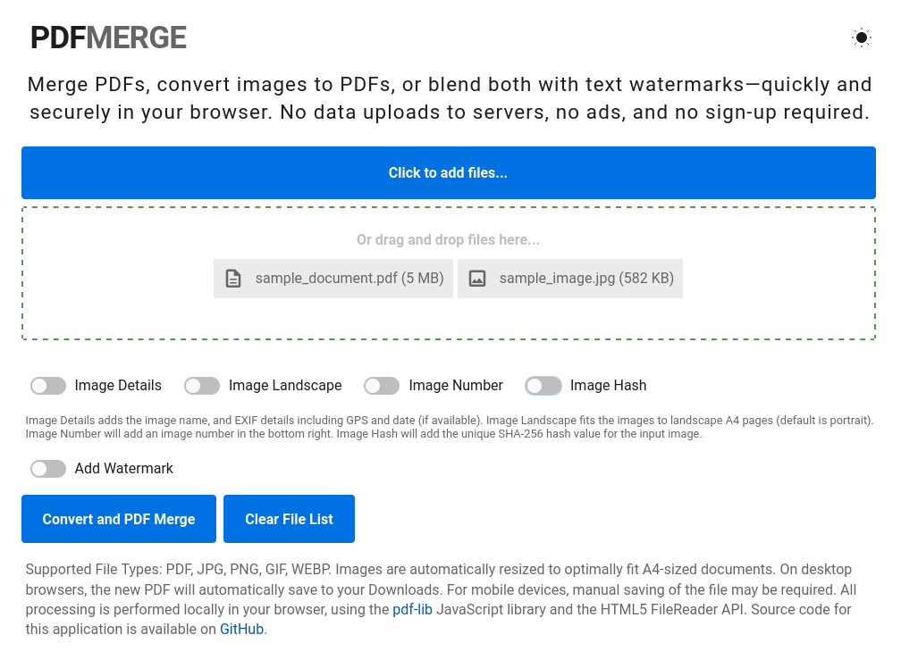

# PDFMerge

PDFMerge is a web-based application for merging PDFs and images into a single document. It operates entirely client-side for maximum privacy, using JavaScript, HTML, and CSS. Built on the robust [PDF-LIB.js](https://pdf-lib.js.org/) library, PDFMerge offers efficient PDF generation and manipulation. It also leverages the HTML5 FileReader API for image handling, and basic GPS and date EXIF details from photos thanks to [ExifReader](https://github.com/mattiasw/ExifReader). Key features include:

- Merging PDFs/Images: Combine PDFs with .jpg, .png, .webp, .gif.
- Image Optimisation: Automatic resizing and optimisation for PDF A4 page format.
- Privacy Focus: No server uploads, ensuring user data privacy.
- EXIF Data Integration for images/photos: Optionally add file names, SHA-256 hash, and GPS/date EXIF details.
- Customisable Watermarking: Add text watermarks with adjustable color and opacity.
- Browser Compatibility: Optimal in Google Chrome; functional in other browsers with potential limitations.

## Try it out @ [pdfmerge.me](https://pdfmerge.me)

## Screenshots

## Known Limitations and Testing

- **In-Browser Processing Constraints:** PDFMerge runs directly in your browser, using client-side resources. This approach guarantees data privacy and eliminates the need for server-side data transfer. However, it does limit performance to what your device and browser can handle. This is particularly noticeable with large image files. Image files are restricted to a maximum size of 50MB due to potential performance issues during resizing with the HTML5 FileReader method. For larger images, it's advisable to use external tools to reduce their size and resolution before using them with the PDFMerge application. In testing [Google Chrome](https://www.google.com.au/chrome/) was able to handle larger files sizes and also larger lists of files at once better than Firefox. Firefox on occassion would hang and timeout on the same file lists which Chrome could process.

## Credits and Third-Party Licensing
- **[PDF-LIB.js](https://pdf-lib.js.org/)** by Andrew-Dillon | [MIT License](https://opensource.org/licenses/MIT)
- **[ExifReader](https://github.com/mattiasw/ExifReader)** by Mattias Wallander | [MPL-2.0 license](https://www.mozilla.org/en-US/MPL/2.0/)
- **Roboto Regular, Bold, and Black Fonts** by Christian Robertson | [Apache License, Version 2.0](https://www.apache.org/licenses/LICENSE-2.0)

